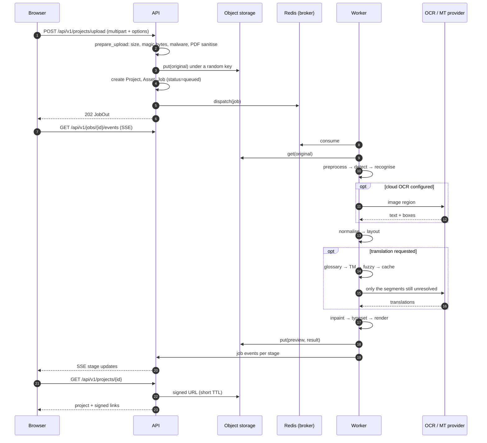
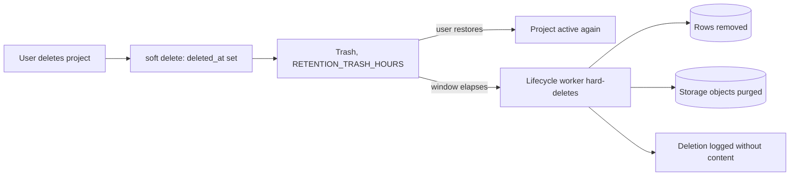
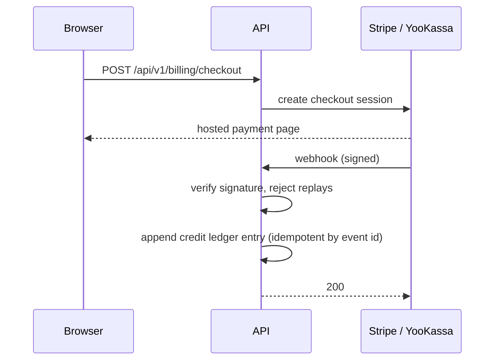

# Data flow

How a file moves through the system, and where each artefact ends up. See
[system-overview.md](system-overview.md) for the container diagram and
[security-boundaries.md](security-boundaries.md) for where the trust changes.

## Upload → result

## What is written where

| Artefact                   | Store                      | Lifetime                                                            |
| -------------------------- | -------------------------- | ------------------------------------------------------------------- |
| Original upload            | Object storage, random key | Plan retention (`RETENTION_*_HOURS`)                                |
| Preview / thumbnail        | Object storage             | `RETENTION_INTERMEDIATE_HOURS` (6h)                                 |
| Rendered result            | Object storage             | Plan retention                                                      |
| Export (PDF/DOCX/XLSX/…)   | Object storage             | Plan retention; re-export of identical settings reuses the artefact |
| Text regions, translations | PostgreSQL                 | With the project                                                    |
| Job + stage events         | PostgreSQL                 | With the project                                                    |
| Credit ledger entries      | PostgreSQL                 | Append-only, never deleted                                          |
| Analytics events           | PostgreSQL                 | Allow-listed properties only                                        |

Intermediate masks and per-stage scratch files are deleted by the worker as
soon as the stage that produced them completes; they are never addressable
from the API.

## Editing an existing project

Region edits are server-authoritative. The browser sends a PATCH carrying the
region's `version`; the API rejects a stale version with a conflict rather
than silently overwriting, and the editor surfaces that as "someone changed
this first". Undo replays an inverse PATCH — it does not rewind local state,
so two tabs cannot diverge.

Re-rendering after an edit reuses the recognised regions and only redoes
inpaint + typeset + render, which is why an edit costs no OCR credit.

## Deletion

Account deletion cascades the same way across every project the account owns.
Billing records are kept where tax law requires, with personal identifiers
minimised.

## Money flow

Credits are only ever changed by appending to the ledger; the wallet balance
is derived from it, so a double-delivered webhook cannot double-credit and a
failed job refunds exactly what it charged.
