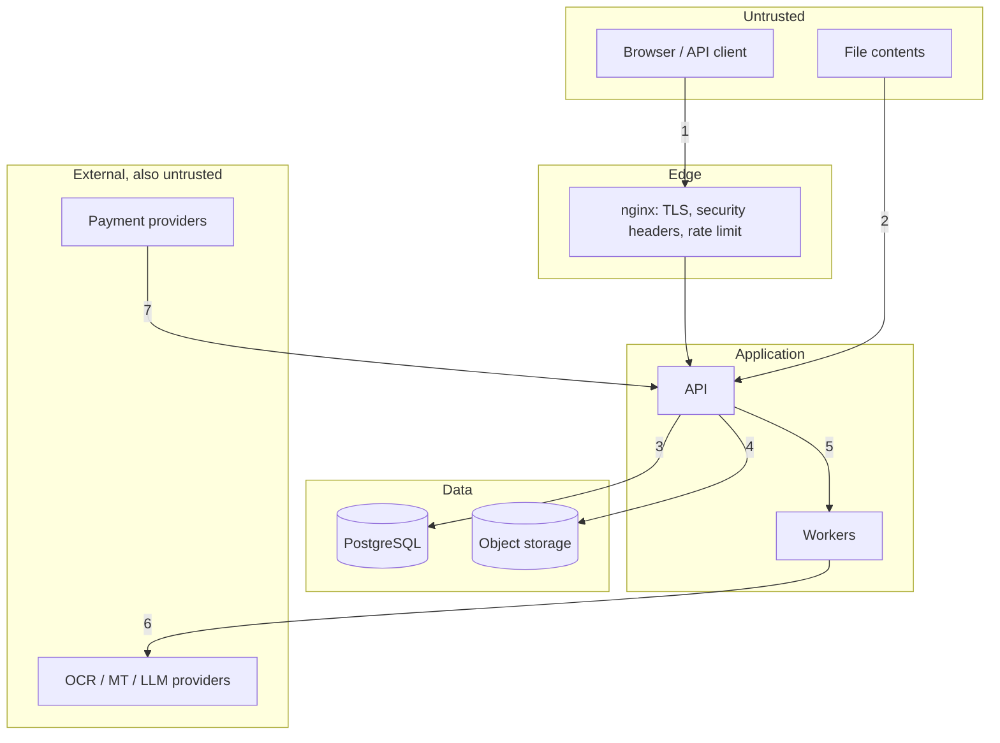

# Security boundaries

Where trust changes hands, and what is enforced at each crossing. The threats
themselves are in [threat-model.md](../security/threat-model.md); this page is
the map.

## 1 — Client → API

- Session cookies are HTTP-only, `SameSite`, and `Secure` in production (the
  config validator refuses to start otherwise).
- CSRF token required on cookie-authenticated state-changing requests; bearer
  API keys are exempt because they cannot be sent ambiently by a browser.
- Rate limits per IP hash, per user, per API key.
- Authorisation is checked per object, not per route. Another account's
  project returns **404, not 403** — a 403 confirms the id exists.

## 2 — File contents → API

The most important boundary in the product. A file is data, never
instruction.

- Type comes from magic bytes, not the extension or the declared MIME.
- Dangerous extensions refused outright; SVG refused unless explicitly
  enabled.
- Decompression-bomb guards on both images (pixel budget) and PDFs.
- PDFs are stripped of JavaScript and auto-actions before anything opens them.
- Filenames are sanitised against traversal, alternate data streams and
  RTL-override tricks before they reach storage or `Content-Disposition`.
- Optional ClamAV hook for deployments that want it.

## 3 — API → PostgreSQL

- Parameterised queries throughout (SQLAlchemy); no string-built SQL.
- Credit changes go through a transactional, append-only ledger with
  idempotency keys, so a retried request cannot double-charge.
- Optimistic locking on regions; concurrent edits conflict rather than
  silently overwrite.

## 4 — API → object storage

- Buckets are private. Public access blocked is on the production checklist.
- Keys are random and unguessable — knowing a project id tells you nothing
  about its object keys.
- Downloads are short-lived signed URLs (`SIGNED_URL_TTL_SECONDS`), never
  permanent links.
- Server-side encryption where the provider supports it.

## 5 — API → workers

- The queue carries ids and settings, never file bytes or recognised text.
- Jobs are idempotent by key; a redelivered message cannot re-charge credits.
- Workers run as a non-root user with memory and time limits.

## 6 — Workers → external providers

This is an **egress** boundary and it is where user content leaves the system.

- Nothing leaves at all when `LOCAL_ONLY_PROCESSING=true`.
- Only the minimum is sent: the text or image region, not the whole document.
- URLs, emails, product codes and template variables are masked before
  translation providers see them.
- Any server-side fetch is SSRF-guarded — no internal addresses, no redirects
  into private ranges.
- **LLM specifically**: document content is passed as delimited, untrusted
  data. The system prompt forbids following instructions found inside it, no
  tools are exposed, and the response must satisfy a strict schema or be
  retried a bounded number of times. See
  [llm-safety.md](../security/llm-safety.md).

## 7 — Payment provider → API

- Webhook signatures verified before the body is parsed as meaningful.
- Replay protection: an event id already applied is acknowledged and ignored.
- The webhook is the only thing that may grant credits — the browser cannot,
  even by replaying its own successful checkout.

## Admin

`/admin` is a separate surface with its own role check on every endpoint, a
mandatory reason on mutating actions, and an append-only audit trail. Staff do
not see document contents by default; opening a user's file is a distinct,
audited action rather than a side effect of browsing.

## What is deliberately _not_ a boundary

The web app and the API share an origin in the default deployment. The web tier
holds no secrets and makes no authorisation decisions — it renders what the API
already decided the caller may see. Treat any authorisation logic appearing in
`apps/web` as a bug.
