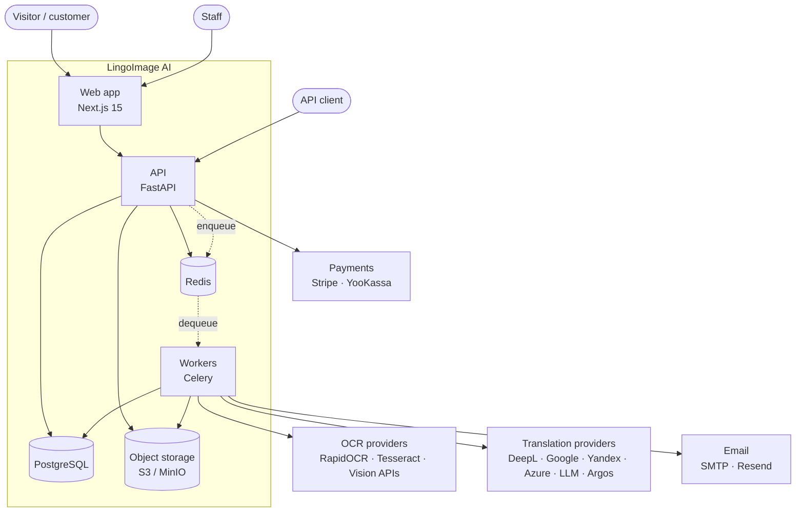
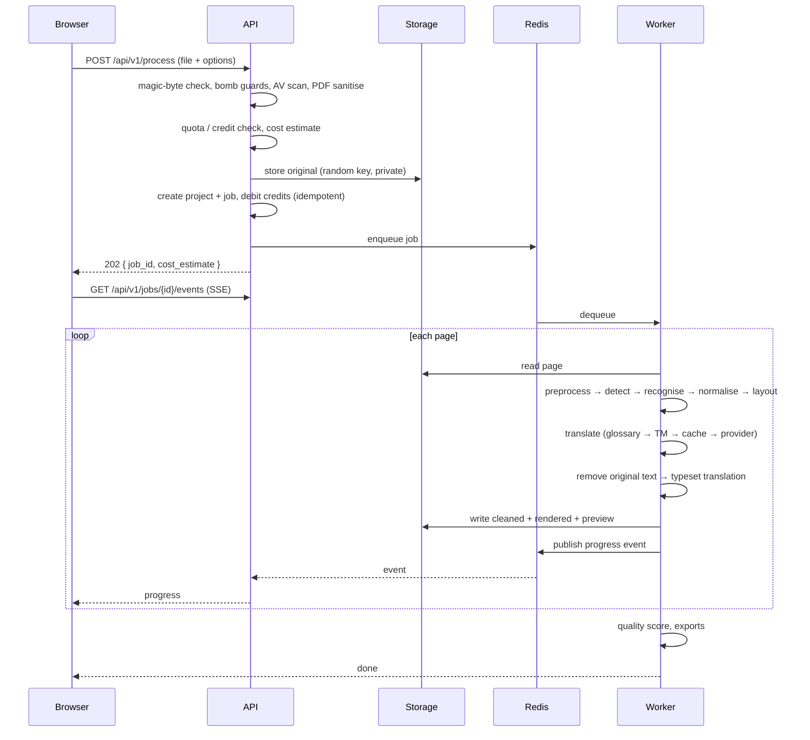
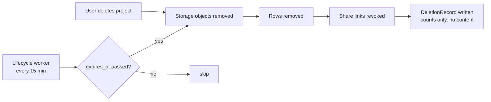
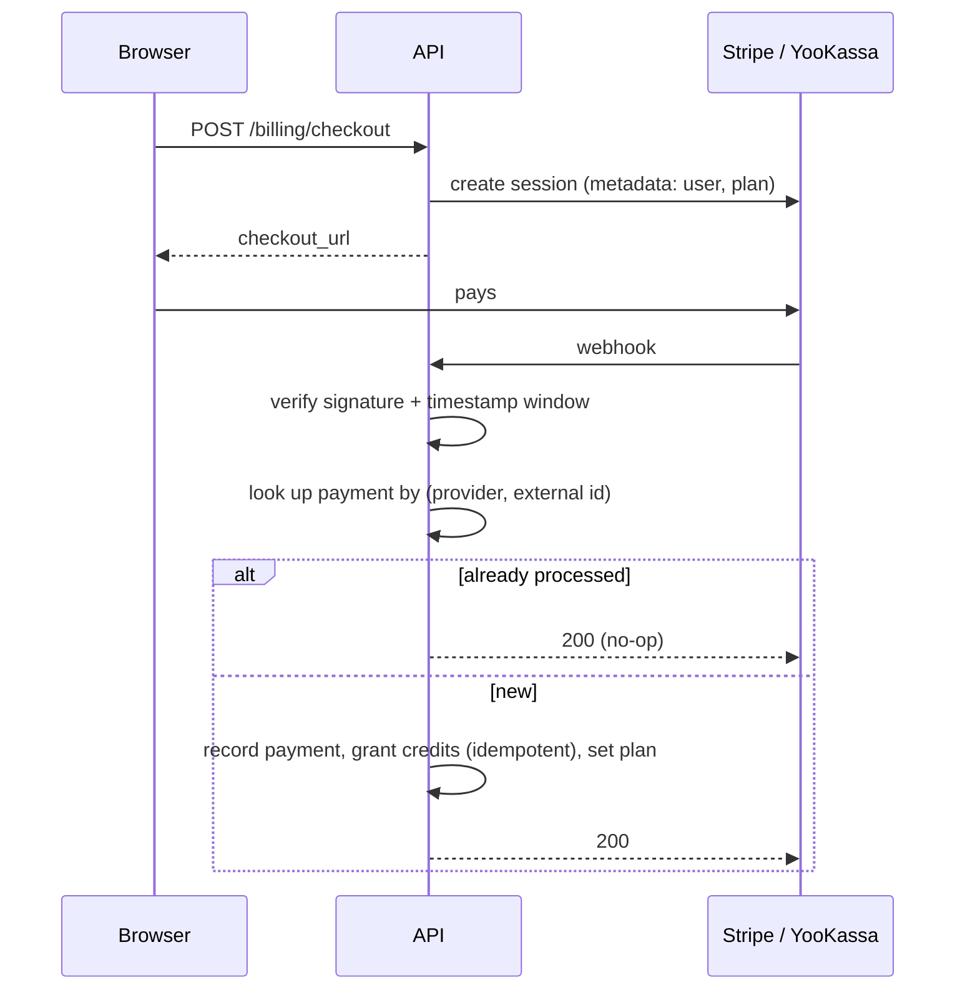

# System overview

## Context

The web tier never talks to a provider and never opens an image. Everything
heavy happens in workers, which is why a slow vendor cannot make the site slow.

## Containers

| Component | Responsibility | Scales on |
|---|---|---|
| `web` | SSR marketing and app pages, editor UI | requests |
| `api` | HTTP, auth, quotas, job creation, SSE progress | requests |
| `worker-cpu` | Preprocess, OCR, translate, inpaint, render | queue depth |
| `worker-export` | Export generation, webhooks, email | export volume |
| `worker-beat` | Retention sweep, stuck jobs, webhook retries, monthly credits | fixed (1) |
| `worker-gpu` | Optional advanced inpainting | GPU availability |

The API and the workers install the **same** Python package (`lingoimage`), so
the models, provider adapters and pipeline cannot drift between tiers. Only the
extras differ: workers carry OpenCV, Tesseract language packs and the ONNX
models; the API image does not.

## Upload and processing flow

A page that fails does not fail the job: the other pages are saved, the job ends
`partially_completed`, and the credits for the failed pages are refunded.

## Deletion flow

Retention is a column, not a rule buried in code: anything holding user content
carries `expires_at`, so one sweep handles guests, free accounts, intermediate
artefacts, exports and the trash.

## Payment flow

Replaying a webhook is inert by construction: the credit grant is keyed on
`payment:{id}:credits`, so the second delivery finds the existing ledger row.

## Data model

Around 50 tables. The parts worth knowing:

* `projects` → `document_pages` → `text_regions` → `region_translations`.
  A region keeps the raw OCR string *and* the normalised one, so nothing is lost.
* `assets` holds every stored object with its `kind` and `expires_at`.
* `jobs` + `job_events` give the timeline, progress and error reference.
* `credit_wallets` + `credit_ledger_entries` — the ledger is append-only and
  every entry carries a unique idempotency key; the wallet is its running sum.
* `audit_logs` is append-only and records the reason for every staff action.

Full schema: `apps/api/lingoimage/db/models.py`.

## Failure behaviour

| Failure | Result |
|---|---|
| One OCR provider down | Chain falls through to the next; circuit breaker opens after 5 failures |
| Every provider down | Job fails with `provider_unavailable`, credits refunded |
| Redis down | Rate limiting, cache and events fall back in-process; jobs still run |
| Worker killed mid-job | Heartbeat goes stale, beat re-queues it, idempotent charge prevents double billing |
| Storage down | Job fails with `storage_failed`, credits refunded |
| Provider over budget | Provider is skipped before it is called |
